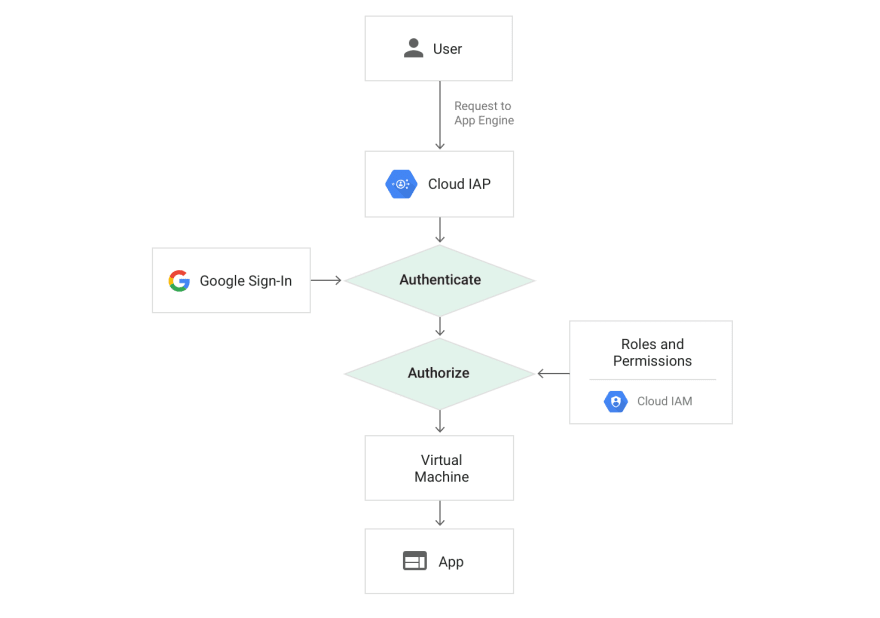

# Giới thiệu về Identity Aware Proxy (IAP)

Như tên gọi, thì IAP là proxy cung cấp khả năng truy cập an toàn tới các service upstream, thông qua các rule authen/authorize tích hợp với các hệ thống IdP.
Với IAP thì hoàn toàn có thể truy cập thông qua giao thức HTTPs (proxy) thay vì phải kết nối với mạng VPN(network). Vì lý do này, ta có thể truy cập các hệ thống nội bộ chỉ cần dùng trình duyệt hiện có, không cần cài thêm các client nào khác.
Giải pháp chủ yếu biết đến được triển khai từ Google Cloud, về phía Opensource khác có thể kể đến là ORY Oathkeeper và Pomerium.
Ngoài việc cấu hình HTTP route, Pomerium còn cung cấp khả năng route ở layer 4 (TCP) tới các service nội bộ - với tính năng này, yêu cầu người dùng sẽ phải sử dụng client.

# Lab 
Bài lab được thực hiện trên single node, mô hình triển khai như sau:
- Nginx đóng vai trò là Reverse Proxy cho KeyCloak
- Forward các traffic còn lại về phía Pomerium
- Sử dụng Pomerium xác thực user với tính năng JWTs ( [tham khảo thêm tại Docs](https://www.pomerium.com/docs/courses/fundamentals/jwt-verification)),
- Grafana sử dụng JWT auth, và role mapping qua KeyCloak User's group.

***Lưu ý:*** Repo này chỉ sử dụng trong mục đích lưu trữ, vậy nên không kèm TLS certs, signing key. Cập nhật lại các thông tin này cũng như KeyCloak Client's credential để sử dụng.